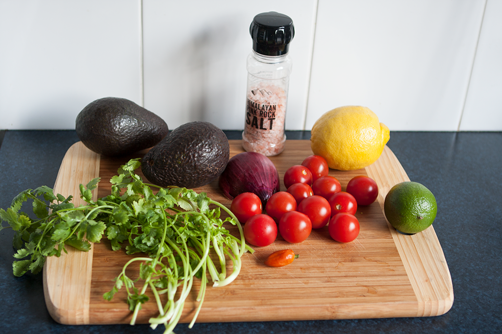

# Guacamole #

* About 20 minutes
* 30 minutes cooling

## Quantity ##
* 6 servings

## Ingredients ##
* 4 ripe avocado
* 5 or 6 cherry tomatoes
* ¼ freshly juiced lime
* ¾ freshly juiced lemon
* 1 small bunch of fresh coriander finely chopped with stalks
* ½ red onion finely chopped
* 1 small French shallot finely chopped
* 1 fresh Serrano chile unseeded and finely chopped

## Preparation ##
Mix everything together except the avocados up until you get a paste. You may use a blender or a pillar and a bowl.

Cut the avocados in half, remove the seed. Cut again in half and peel the skin off. With a "potato masher", gently mash the avocados (you want to keep chunks of avocados) and then add the paste.

Put for about 30 minutes in the fridge.

## Serving ##
Serve with corn chips
