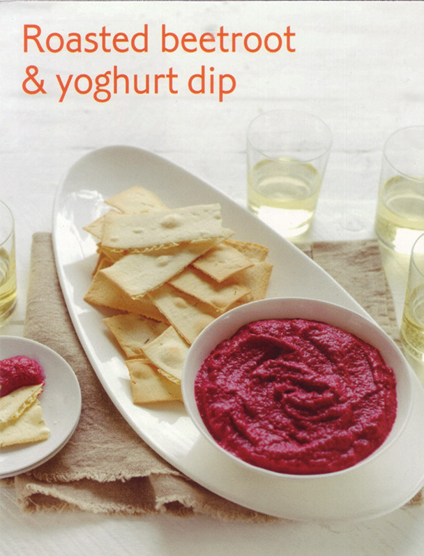

# Roasted beetroot and yoghurt dip #

* 30 minutes
* 60 minutes cooking time
* 120 minutes cooling time (or overnight)

## Quantity ##
* 2½ cups

## Ingredients ##
* 1kg fresh beetroot
* 2 tbsp fresh orange juice
* 3 tbsp ground cumin
* 2 tbsp ground coriander
* ¾ cup Greek-style thick natural yoghurt
* Salt
* Ground black pepper
* Lavash crisp breads or grilled Turkish bread, to serve

## Cooking ##
Preheat your oven to 200°C/180°C with the fan forced. Trim beets, leaving 2~3 cm stalk attached to each beet. Gently scrub and pat dry with paper towel. Wrap each beet in a aluminium foil. Please on a baking tray and roast, turning every 10 minutes, for 1 hour or until tender when tested with a skewer or a knife. Remove from oven, carefully open the foil and stand for 15 minutes. Wearing disposable gloves, gently peel the beets and roughly chop the flesh.

Please the chopped beetroot, orange juice, cumin and coriander in a food processor. Process until smooth. Add yoghurt and season with salt and pepper to your taste. Process until combined. Transfer to a bowl and refrigerate for 2 hours or overnight for flavours to develop.

## Serving ##
To serve, spoon dip into a serving bowl and serve with lavash crisp breads or grilled Turkish bread.
