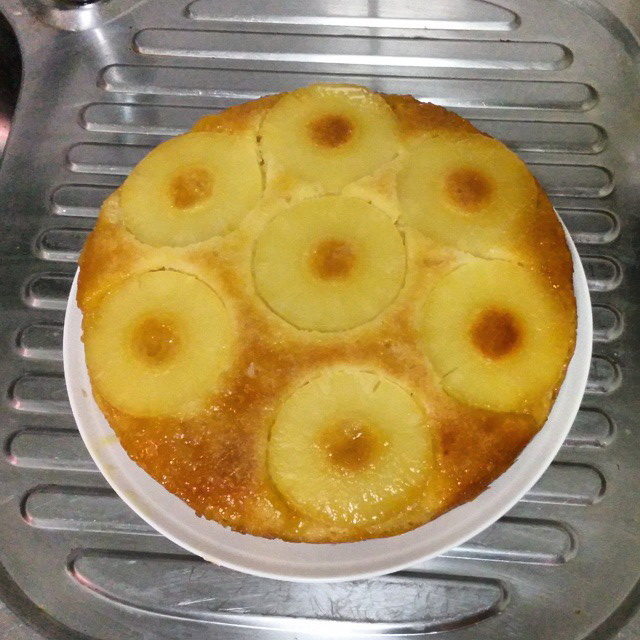

# Caramel Pineapple Cake #

* About 15 minutes
* About 30 minutes cooking
* 2 hours cooling

## Quantity ##
* 6 to 8 serves

## Ingredients ##
* 110gr sugar
* 150gr flour
* 120gr melted butter (not hot)
* 2 tspn vanilla extract, or 2 spoons of vanilla sugar
* 3 eggs
* 2 tspn baking powder
* 8 pineapple slices in a tin with the juice

## Preparation ##
Pre-warm your over at 200°C.

Drain the pineapple slices so they don't contain much juice. Keep them in full. Mix the sugar, the vanilla the flour, the eggs, the baking powder and the butter together until you get a thick and smooth batter.

Butter the bottom of your cake disk thoroughly and dispose the pineapple slices at the bottom.

Make some (wet) caramel or use any pre-made liquid caramel (Do not use caramel that contain dairy products).

Pour the caramel on top of your pineapple slices and cover up with the batter.

## Cooking ##
Place in the oven and cook for 25 to 30 minutes at 160°C.

Extract the cake by flipping the cake dish in a plate. Pour the pineapple juice until the cake becomes wet.

Place the cake in your fridge until cool, but not cold.
