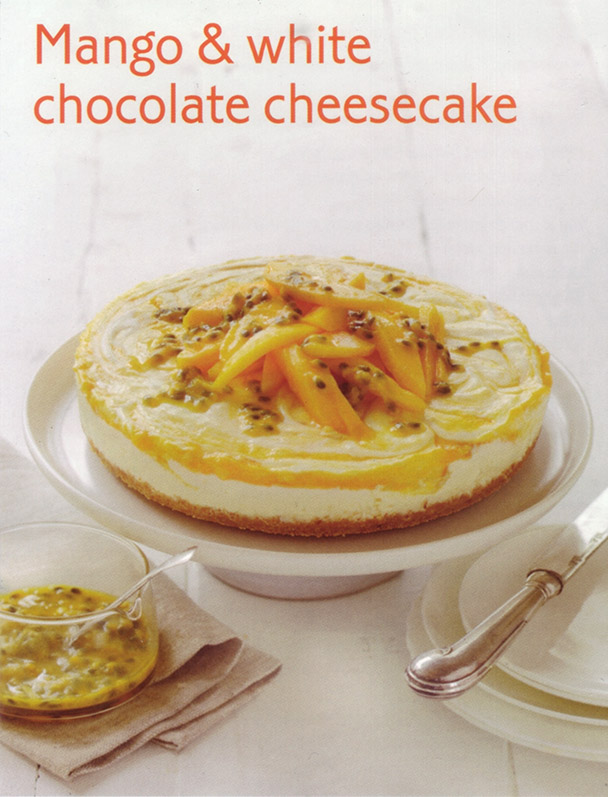

# Mango and white chocolate cheesecake #

* 35 minutes
* 2/3 hours chilling time

## Quantity ##
4 serves

## Ingredients ##
* 200gr plain sweet biscuits (like Arnotts Nice)
* 100gr butter, melted + extra greasing
* 2 ripe medium size mangoes
* 10gr sachet gelatine (or 2 tablespoon of gelatine powder)
* ¼ cup of boiling water
* 250gr white chocolate
* 500gr spreadable 60%-less fat cream cheese
* ½ cup caster sugar
* 300ml thickened cream
* 2 passion fruit, pulp removed, to serve

## Preparation ##
Lightly grease and line the base of a 22cm spring-form pan with baking paper. Place the biscuits into a food processor. Process until fine crumbs form Add melted butter and process until combined. Press mixture into the base of pan. Refrigerate for 30 minutes.

Meanwhile, in a  dry food processor bowl, peel 1 mango and remove the flesh. Set aside. Stir gelatine and boiling water in a cup until gelatine dissolves. Set aside. Melt chocolate in a heatproof bowl in the microwave on medium power for 1 minute at a time. stirring with a metal spoon, until just melted. Stir and set aside.

Using and electric hand beater mix cream and cheese and sugar until light and fluffy. Beat in gelatine mixture, melted chocolate and cream. Swirl through  pureed mango . Spoon mixture into biscuit base. Cover and refrigerate overnight.

## Serving ##
To serve, transfer the cheesecake to a serving plate. Peel and slice remaining mango. Decorate with mango, drizzle with passion fruit pulp and serve
