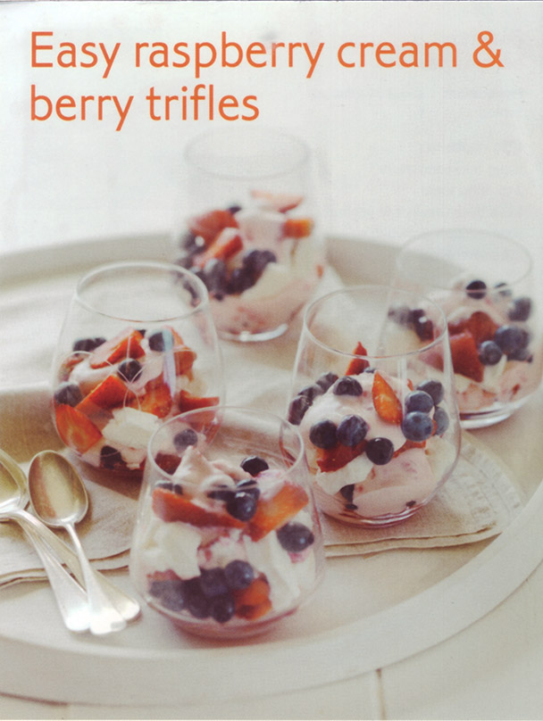

# Raspberry cream and berry triffles #

* 30 minutes

## Quantity ##
* 6 serves

## Ingredients ##
* 125gr raspberries
* ⅔ cup thickened cream
* 2 tbsp icing sugar
* 1 cup thick Greek-style yoghurt
* 500gr medium strawberries
* 250gr blueberries
* 100gr meringues, roughly crushed

## Preparation ##
Place the raspberries in a bowl and roughly crush them with a fork. Whip the cream and 1 tbsp of icing sugar in a medium mixing bowl until soft peaks form. Beat in the yoghurt. Swirl through raspberries. Chill for 10 minutes.

Hull the strawberries and slice lengthways. Place in a bowl and add the blueberries.

Sprinkle with the remaining icing sugar (1tbsp) and gently toss to combine. Set aside for 10 minutes.

Layer the crushed meringues, raspberry cream and berries in 6x1 cup serving glasses (or use a 6-8 cup trifle bowl if preferred).

Cover and refrigerate for 1 hour and serve.
