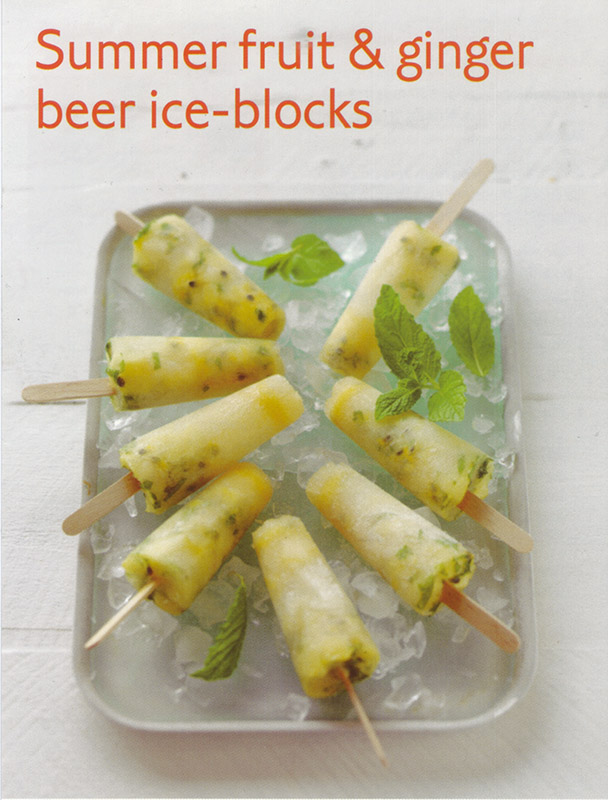

# Summer fruit and Ginger beer ice-blocks #

* About 20 minutes
* Overnight freezing time

## Quantity ##
* 6 serves

## Ingredients ##
* 2 ripe white peaches
* 2 passion fruits, pulp removed
* ¼ cup mint leaves, finely chopped
* 2 table spoon lime juice
* 1 table spoon icing sugar
* 1 cup ginger beer

## Preparation ##
Place the peaches in a heatproof bowl. Cover with boiling water and for 30 seconds. Refresh in cold water and peel. Finely chop the peaches flesh and place in a bowl.
Add the passion fruits pulp, the mint and the lime juice.
Sprinkle with icing sugar and stand for ~10 minutes.

Pour the beer over the fruits and stir to combine. Spoon the mixture in 6 ice-block moulds (about ⅓ cup each), gently tap the moulds on the kitchen bench to remove any air bubbles.

Freeze overnight.

Remove from moulds to serve.
