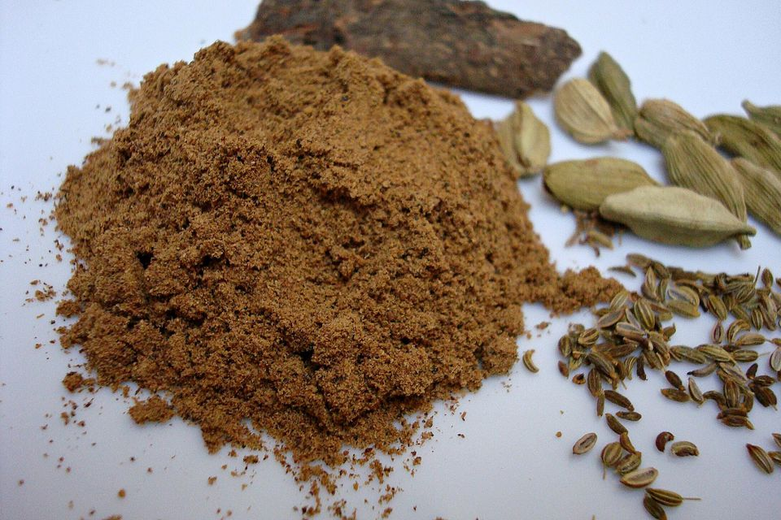

# Ras el hanout #

See the wikipedia.org [article](http://en.wikipedia.org/wiki/Ras_el_hanout).

## Ingredients ##

* Salt
* Natural chicken flavour
* Pepper
* Garlic
* sugar
* Onion
* Rice flour
* Rosemary
* Tumeric
* Paprika
* Capsicum
* Coriander
* Cumin
* Canola oil
* Ginger
* Lemon flavour
