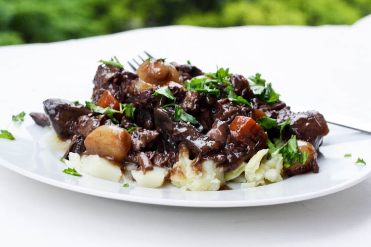

# Beef bourguignon #

* 15 minutes initial meat preparation
* About 60 to 90 minutes
* 2 to 4 hours cooking

## Quantity ##
* 6 serves

## Ingredients ##
* 1.2l red wine, fruity, 12.5/13% (Cabernet Merlot type)
* 1kg beef cut into large chunks (preferably wagyu but any braising beef such as rump, topside or chuck steak is fine)
* 100gr pancetta thinly sliced
* 200gr pork speck. Prefer good quality low in fat
* _200gr quality bacon, rind-less (to replace pork speck)_

* 2 onions (1 brown, 1 red)
* 1 leek (the lower/tubular part)
* 5 carrots
* 200gr mushroom in tin (halves)
* 3 garlic cloves
* 1 bouquet garni (2 or 3 sprig thyme, 2 sprig curly parsley, 1 bay leaf, rosemary)
* 1 KubOr or 200ml quality beef stock
* Wheat flour or corn flour
* Olive oil
* Salt
* Black pepper

## Preparation ##

### Part 1 : Prepare the meat ###
In a large pot:
* Peel the carrot, slice them 5mm thick and put then at the bottom of your pot
* Add your bouquet garni
* Add the meat
* Top with wine
* Marinate overnight

### Part 2 : Getting ready ###
* Separate meat, wine and carrots
* Finely chop your onions
* Finely chop your garlic cloves
* Boil the wine so the alcohol evaporates
* Cut in strip your pancetta and remove the fat
* Cut in strip your bacon and remove excess of fat
* keep the tubular part of the leek and cut in 2 pieces. Slice 1 part (the greenest), 3mm thick
* boil water and pour 300ml on the KubOr, or use 300ml vegetable stock

### Part 3 : Cooking the meat ###
In a large fry-pan (see note):
* Cook the pork speck until blond/brown. Remove excess of fat. Put on paper towel and pat dry. Set aside
*  _Cook the bacon, and then slice in 1cm_
* Cook 500gr beef. Keep meat juice. No need to add salt. Set aside drained
* Cook garlic, onion, the sliced leek and the pancetta in the pan (with the meat juice and a bit of stock). Set aside drained
* Cook the last 500gr of beef with the meat juice. Set aside drained
* Deglaze the pan with the beef stock of the kubOr and put to boil for 3~5 minutes

**Note**: Make sure you keep the juice in the pan. Cooking the next ingredient in the existing juice will add extra flavor to the recipe.

### Part 4 : Cooking (Round 1) ###
In one large:
* Put the carrots and the bouquet garni in the pot
* Add the cooked beef, the pancetta, the garlic, onions, sliced bacon, sliced leek
* Pour 1l wine and stock until everything is covered
* Add pepper
* _Add salt if beef stock / needed (Do not salt too much)_
* Bring to boil and reduce to simmer
* Cook for 90 minutes
* Leave to rest over night

### Part 5 : Cooking (Round 2) ###
Cook a 2nd time, for about 60 minutes. When hot, slowly add flour to liaise the sauce and the wine. Add extra wine if not enough liquid. Add more flour if too watery.

### Serving ###
Your beef bourguignon is ideally served with creamy mashed potatoes. Desiree potato is best when mixed with butter and fresh cream. You can also serve it with fresh pasta with butter.
