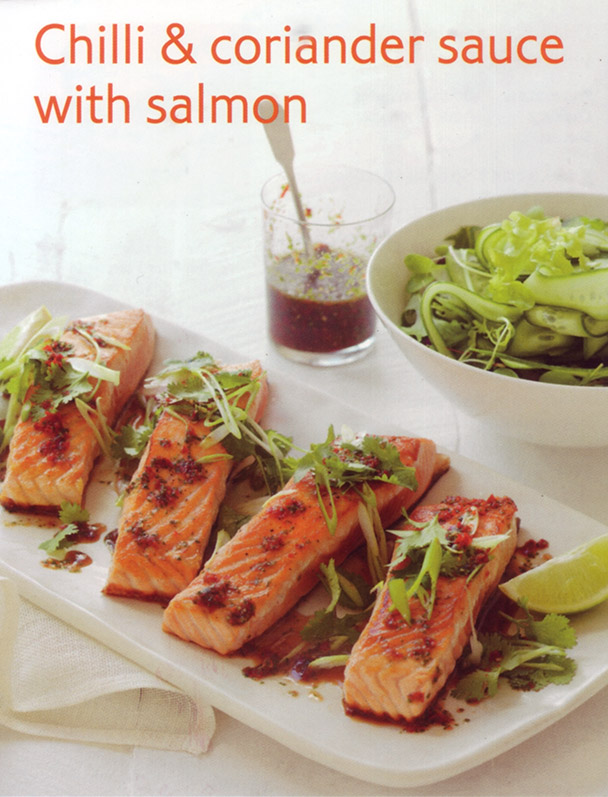

# Chilli and coriander sauce with salmon #

* about 20 minutes preparation
* about 10 minutes cooking

## Quantity ##
* 4 serves

## Ingredients ##

* Main
  * 4 thick (about 175gr each) Atlantic salmon fillets (skin on)
  * Olive oil cooking spray
  * Salt
  * Black Pepper ground
  * 2 Lebanese cucumber, thinly sliced lengthways
  * 100gr baby Asian salad leaves

* Chilli and coriander sauce
  * 4 long red chillies (about 80g), deseeded
  * 2 small red chillies, deseeded
  * ⅓ cup lime juice
  * 1 cup firmly packed coriander leaves
  * 2 tablespoon fish sauce
  * ¼ cup caster sugar

## Preparation ##
To make chilli and coriander sauce, combine all ingredients in a food processor. Process until evenly chopped. Set aside.

Heat a large greased non stick frying pan or barbecue plate over medium heat. Spray salmon with oil and season with salt and pepper. Cook the salmon for 3 to 4 minutes until just cooked through (or cook to your liking depending on the thickness).

## Serving ##
Toss cucumber and salad greens in a bowl. Serve salmon with salad and chilli and coriander sauce.
