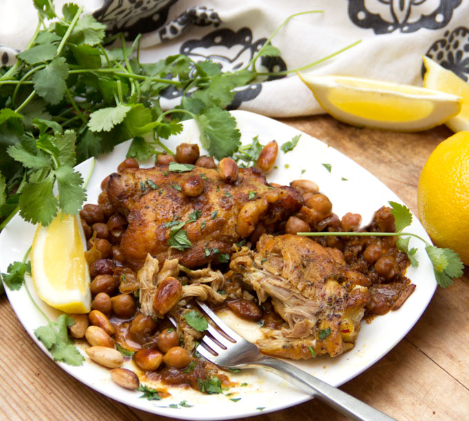

# Tagine #

## Ingredients ##
Spice rub
* sea salt or himalayan crystal salt
* freshly ground black pepper
* 1 level tablespoon ras el hanout spice mix
* 1 level tablespoon ground cumin
* 1 level tablespoon ground cinnamon
* 1 level tablespoon ground ginger or 1 level tablespoon ginger paste
* 1 level tablespoon sweet paprika (or mild paprika)

Main
* 600 g quality stewing beef or 4/6 chicken drumstick
* Olive oil
* 1 onion, peeled and finely chopped
* 1 small bunch of fresh coriander
* 400g tinned chickpeas, drained. Or 3 glasses of dried chickpeas.
* 600g tinned chopped tomatoes
* 400 ml organic vegetable stock, or chicken stock, or 2~3 Cubor
* 2 or 3 small squash, approximately 800g, de-seeded and cut into 5cm chunks.
* 3 to 5 semi-dry prunes, stoned and roughly torn or 3 to 5 semi-dry figs
* _½ garlic clove finely chopped_
* 2 tablespoons flaked almonds, toasted
* Couscous semolina
* handful of sultanas or 5 semi dry plums

## Preparation ##
Mix all the spice rub ingredients together in a small bowl. Put the meat into a large bowl, massage it with the spice rub, then cover with cling film and put into the fridge for a couple of hours – ideally overnight - that way the spices really penetrate and flavour the meat. If using chicken drumsticks, debone the meat, put the rub under the skin gently. Make sure not to tear the meat apart.

When the meat is ready to cook, finely chop the onions. Separate the coriander leaves from stalks and chop the stalks (~1cm). Wash the squash and cut in chunks of 1 to 2 cm. Drain and rinse the chickpeas. If you don't have the stock available, boil some water and pour 400ml over 2 KubOr.

## Cooking ##
Pre-heat your oven at 150C.

When you're ready to cook, heat a generous lug of olive oil in a tagine pot or casserole. Fry the meat over a medium heat for 5 minutes. Add your chopped onion and coriander stalks and fry for another 5 minutes. Tip in the chickpeas, squash and tomatoes, then pour in 400ml of stock and stir. Bring to the boil, then put the lid on.
IOf cooking with a tagine pot, put it in the oven for  1½ hours at ~125°C.

Drop the sultanas in a glass of hot water to rehydrate them.

At this point, add the prunes and/or figs and the rest of the stock. Add the garlic. Give everything a gentle stir, then pop the lid back on the pan and continue cooking for another 1½ hours. Keep an eye on it and add a splash of water if it looks too dry.

Once the time is up, take the lid off and check the consistency. If it seems a bit too runny, simmer for 5 to 10 minutes, more with the lid off. Add the flaked almonds.

Boil 1.5L of water. In a large bowl, put couscous and the drained sultanas. Pour the water on top and stir. Add progressively the water until the couscous is cooked. Add a nice piece of butter to stop the couscous from absorbing the water.

The meat should be really tender and flaking apart now, so have a taste and season with a pinch or two of salt. Scatter the coriander leaves over the tagine, then take it straight to the table with a big bowl of lightly seasoned couscous and dive in.

## Notes ##
If you use dried chickpeas, you can either soak them overnight in clear water or soak them in the chicken flavoured stock.

The chicken stock may add too much water to the dish, so be gentle on it, especially because tin tomatoes already come with a lot of water too.

The garlic is totally optional but adds a nice flavour to the dish.
