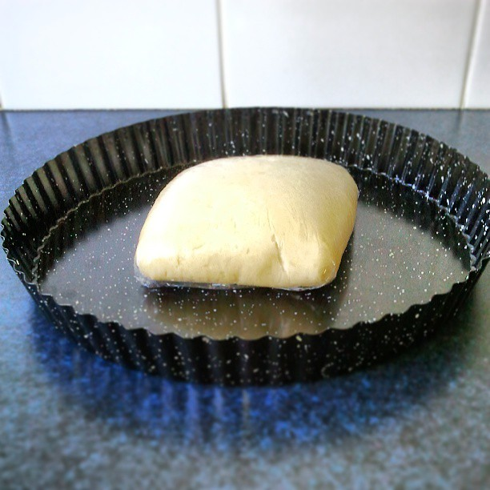
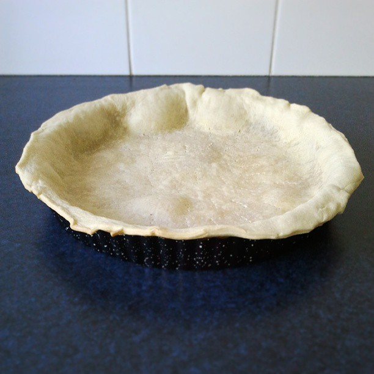

# Shortcurst pastry #

| Before cooking                                    | After cooking                                    |
| :------------------------------------------------ | -----------------------------------------------: |
|  |  |

* About 30 minutes
* Overnight rest, at least 6 hours

## Quantity ##
* 1 serve

## Ingredients ##
* 250gr plain flour
* 125gr butter diced or very soft (not melted)
* ½ tsp of salt
* 8cl of hot water

## Preparation ##

### Part 1 : Making the dough ###
* Put the flour in a large bowl
* Mix the salt and flour
* Incorporate the butter up until you get a sort of semolina
* Add water. A very little amount is necessary to link the dough
* Work on the dough until you obtain a uniform, non-sticky ball

And then
* Wrap the dough in plastic wrap and place it back in the bowl
* Leave it outside for about 6 hours, ideally overnight

### Part 2 : Getting ready ###
* Grease the bottom of your tart pan with butter
* Flour the tart pan on top of your butter
* On a baking paper, roll the dough up until thin enough and later than your tart pan (add 2.5cm extra)
* Flip the dough over the tart pan
* Adjust it correctly and make sure the extra slightly goes over the edges of the tart pan (like a safely belt)

### Part 3 : Cuisson à blanc ###
* Most savoury tart recipes call for par-baking the dough : this is called "cuisson à blanc" in French, and it consists in baking the dough on its own first, because it won't bake as well once the filling is in place.
* Preheat your oven to 180°C
* Use a fork to make small holes in the dough
* Bake for ten minutes or until golden

